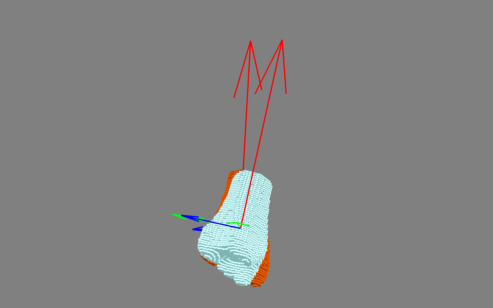

# Vox

## Documentation
https://lukemshepherd.github.io/vox/

## Dependencies 
*See environment.yml* 

You can create a copy of my conda `vox` environment with these commands:

    $ conda env create -f environment.yml

    $ conda activate vox

## OS
Has been written (and runs) on Windows 10, MacOS and Linux (Manjaro 5.6)

## Python
This was written on python 3.6. Python 2 versions won't work due to the use of *f strings*

## mayavi
This is the 3d plotting library used for rendering the plots. Mayvai will launch a qt window to display the plot so you can't use this if you are using something remote like docker- you could set up an X serve session and with SSH but I would recommend just running it locally. There is a jupyter notebooks Extention want to plot things inline in your notebook - however, this is not the most stable or recommended way of plotting.
s
### Optional: inline 3d plotting
[inline plotting docs](http://docs.enthought.com/mayavi/mayavi/tips.html#using-mayavi-in-jupyter-notebooks)
  
  
### mayavi install

[mayavi install docs](https://docs.enthought.com/mayavi/mayavi/installation.html)
 
Mayavi plots images by calling the VTK libray and displying it a qt window- this means it is very very fast, however can be a bit of pain to install. Part of this is caused by its abity to work with difent qt packages, which makes it very flexable but does also mean it can get a bit confused!

You can use conda to install it but using pip seems to be easier and will sort out the VTK install for you.

    $ pip install mayavi

    $ pip install PyQt5

## numpy-quaternion 

Numpy doesn't nativly suport quaternions as a data type- this package always you to pass quaterions properly and makes muliplication an returning the imaginary conponent a lot easier.

[numpy-quaternion github](https://github.com/moble/quaternion)

[numpy-quaternion docs](https://quaternion.readthedocs.io/en/latest/)

    $ conda install -c conda-forge quaternion
    
 or
 
    $ pip install numpy-quaternion
    
# How to use

### *Set custom filter level (optional)*
    bone.filter_level = 0.1

### *Set custom colour for bone(optional)*
    tibia_f1.default_color = (0.8, 0.3, 0)

## 1. Load the data that you want to use
    tibia_f2 = bone.from_matlab_path(matlab_file='phantom/phantom_tibia_f2.mat')

    tibia_f1 = bone.from_matlab_path(matlab_file='phantom/phantom_tibia_f1.mat')

## 2. Rotate the Bone
    voxel_rotate(tibia_f1, tibia_f2)

## 3. Plotting the Rotation
    tibia_f1.plot()
    tibia_f2.plot()
    mlab.show()

Plotting with mayavi is very similar to matplotplib where you build a scene and call it with show()

You can plot bones by calling the `.plot()` method and then `mlab.show()`

## 4. Table of Angles
    df_angles(tibia_f1, tibia_f2, name='tibia')

## Questions
If there are any issues or questions please do ask
