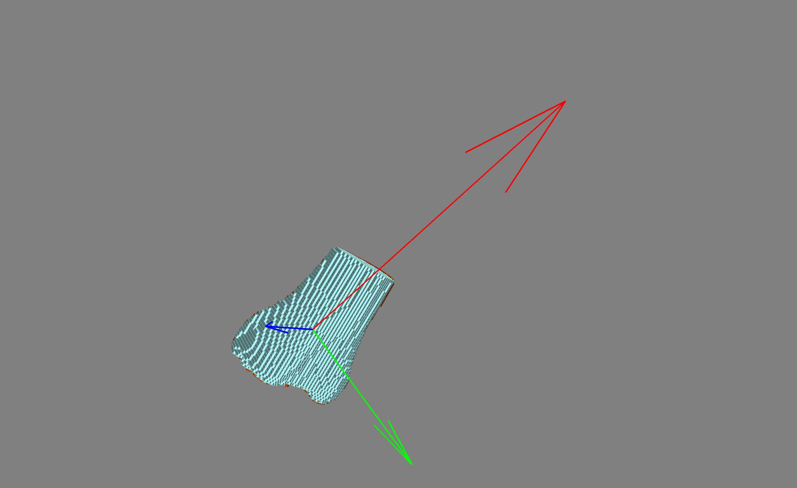

# PCA-2
*Point Cloud Alignment with PCA*

# Vox

## [Documentation](https://lukemshepherd.github.io/PCA-2/)

## [Installation](https://lukemshepherd.github.io/PCA-2/install/)

## How to use

### *Set custom filter level (optional)*
    bone.filter_level = 0.1

### *Set custom colour for bone(optional)*
    tibia_f1.default_color = (0.8, 0.3, 0)

## 1. Load the data that you want to use
    tibia_f2 = bone.from_matlab_path(matlab_file='phantom/phantom_tibia_f2.mat')

    tibia_f1 = bone.from_matlab_path(matlab_file='phantom/phantom_tibia_f1.mat')

## 2. Rotate the bone
    voxel_rotate(tibia_f1, tibia_f2)

## 3. Plotting the rotation
    tibia_f1.plot()
    tibia_f2.plot()
    mlab.show()

Plotting with mayavi is very similar to matplotplib where you build a scene and call it with show()

You can plot bones by calling the `.plot()` method and then `mlab.show()`

## 4. Table of angles
    df_angles(tibia_f1, tibia_f2, name='tibia')

## Questions
If there are any issues or questions please do ask
